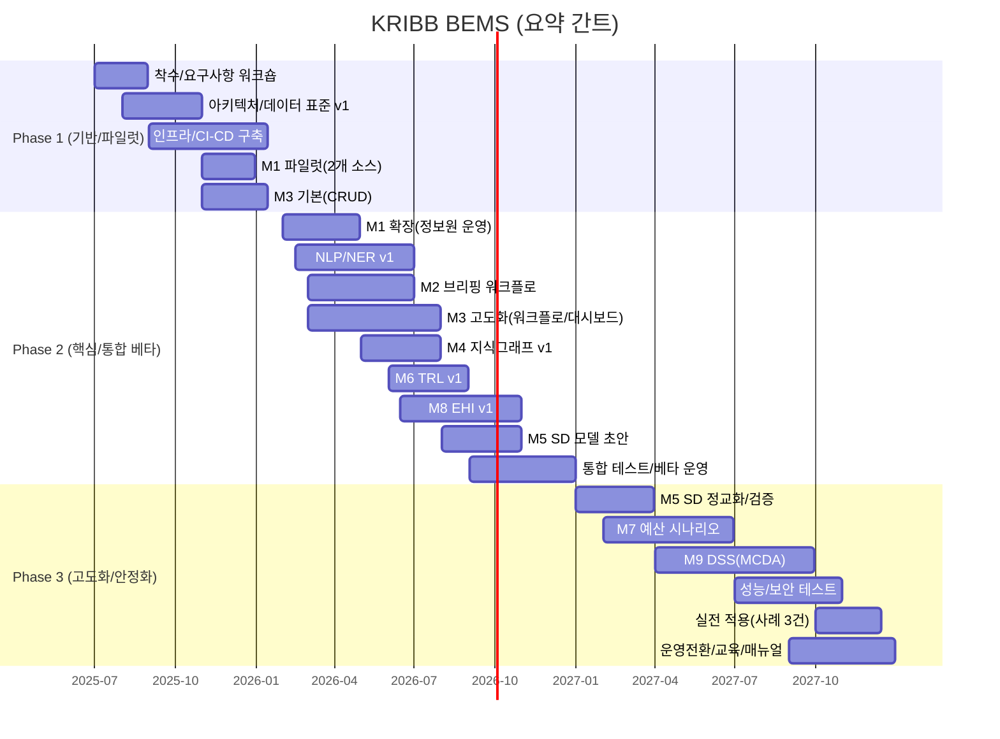

## WBS/간트(표준 산출물)

본 문서는 본 사업의 **표준 WBS 및 간트(요약)**를 제공한다.  
상세 관리용 WBS는 `docs/project/WBS.csv`를 기준으로 한다.

---

## 1. WBS 작성 원칙(표준)

- **단계 기반**: Phase 1(기반) → Phase 2(핵심) → Phase 3(고도화/안정화)
- **검수 게이트**: 단계 종료 시 산출물/성능 기준을 충족해야 다음 단계로 진행
- **추적성**: 모든 요구사항은 RTM(Requirements Traceability Matrix)로 WBS/테스트케이스/산출물과 연결
- **책임 명확화**: Owner_Role 기준(예: PM/아키텍트/DevOps/DE/DS/QA/정책연구팀)

---

## 2. 단계별 핵심 산출물(게이트 기준)

### Phase 1(2025.07~2026.01) — 기반 구축/파일럿

- **설계 산출물**: 아키텍처 설계서(v1), 보안 설계, ERD/온톨로지/지표 표준(v1)
- **인프라 산출물**: VPC/IAM/KMS/로깅/모니터링 기본, CI/CD
- **파일럿**: M1(2개 소스 수집) + M3(이슈 CRUD) 데모

### Phase 2(2026.02~2026.12) — 핵심 모듈 개발/통합 베타

- M1 확장(정보원 운영), NLP/NER 성능 리포트(F1≥0.85)
- M2 브리핑 워크플로, M4 지식그래프 v1, M6 TRL v1, M8 EHI v1
- 통합 테스트 보고서(E2E), 베타 운영/피드백 반영

### Phase 3(2027.01~2027.12) — 시뮬레이션/DSS 완성/실전 적용

- SD 모델 검증(RMSE 목표/민감도/극한조건), M7 예산 시나리오, M9 DSS 완성
- 성능/보안 테스트(응답<3s(95p) 등), 실전 적용 사례 3건
- 운영전환/교육/매뉴얼/런북 완비

---

## 3. 간트(요약)

아래 간트는 **의사결정/보고용 요약**이며, 상세 일정·의존성은 `WBS.csv`를 기준으로 한다.

---

## 4. WBS CSV 사용 가이드

- **관리 기준 파일**: `docs/project/WBS.csv`
- **권장 컬럼**
  - `WBS_ID`: 고정 식별자(변경 시 RTM/테스트/산출물 링크에 영향)
  - `Depends_On`: `;`로 다중 의존성 표기
  - `Acceptance_Criteria`: 단계 검수 시 판단 기준

